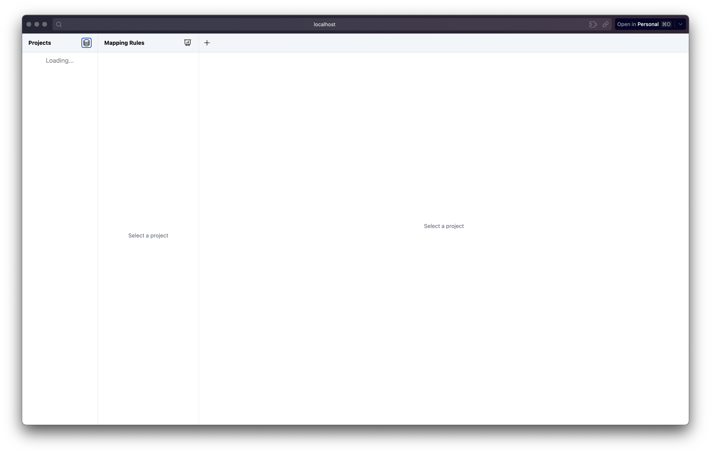
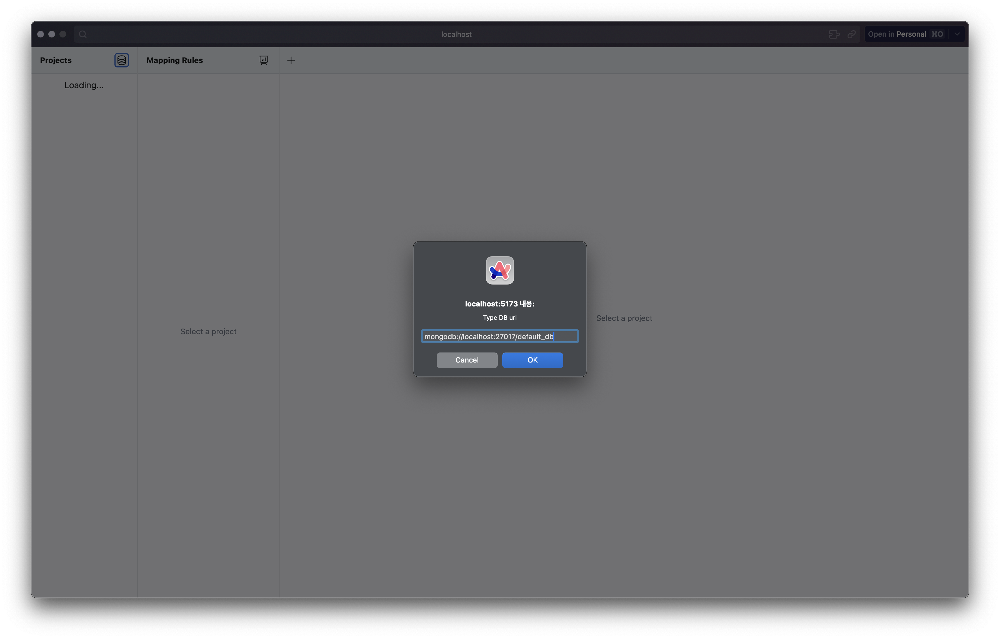
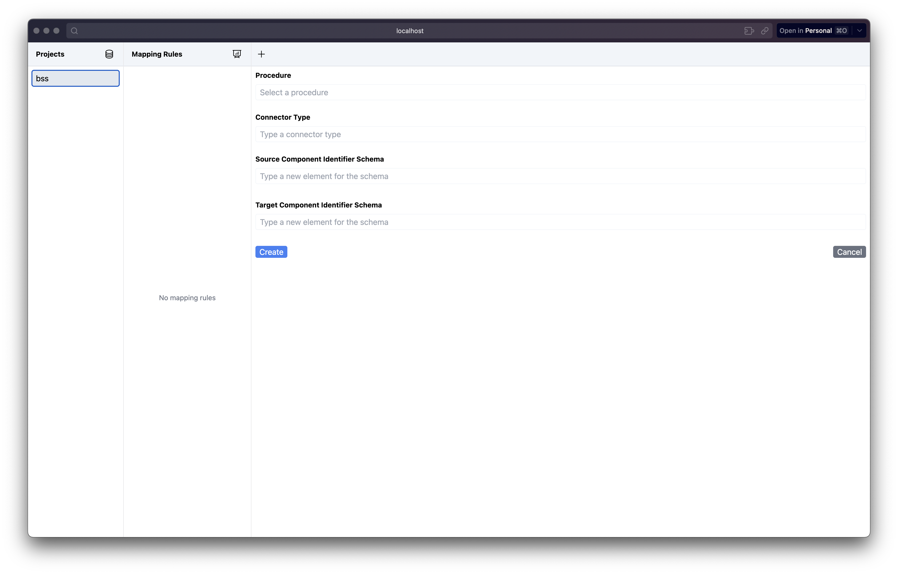
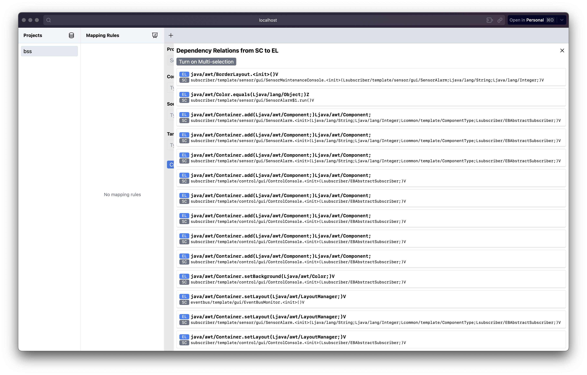
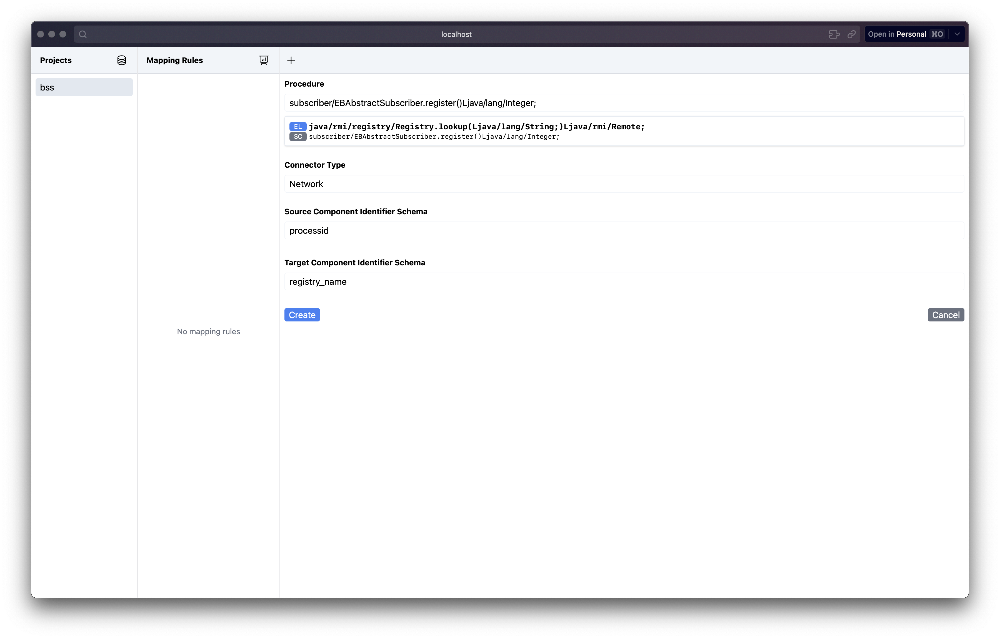

## _Ahn, Hwi, Sungwon Kang, and Seonah Lee. "Architecture view reconstruction by identifying mapping rules for connectors" Journal of Systems and Software 220 (2025)_ 

# Directory Structure

* sarex-toolset
  * sarex: The main CLI tool containing DR Extractor, CI Extractor, and Connector Bulider
  * go-dependencies-reader: DR Extractor plugin for Go language.
  * JavaDependenciesReader: DR Extractor plugin for Java language.
  * js-dependencies-reader: DR Extractor plugin for JavaScript/TypeScript language.
  * mapping-rule-builder: Mapping Rule Builder (GUI tool)

* reconstruction
  * bss: The results of the case study for Building Security System(BSS)
  * trust-chain-services: The results of the case study for Trust Chain Services
  * trust-data-connectome: The results of the case study for Trust Data Connectome
  * sarex-database: A backup of MongoDB storing all the data generated during the three case studies above

# The skill set required to use the CBSAR toolset

* The skill to execute command-line programs using a terminal application
* The skill to execute a local server on a terminal application and connect this local server via a browser

# Guideline to use this tool

## Installation

### sarex command line tool

`sarex` command line tool is built from the source code. First, move to `sarex` directory, then run the following command.

```
cargo build
```

Then, `cargo` will build a binary of `sarex-toolset/sarex` in `target/debug` directory. (This is a Rust project, so basically Rust should be installed first.)

After building the `sarex` command line tool, you need to setup a directory for the configuration of `sarex`.

The directory for the configuration of `sarex` is `$HOME/.sarex`. The structure of `$HOME/.sarex` is as below:

```
$HOME/.sarex
|-- config.json
|-- plugins
|   |-- java
|   |-- js
|   |-- go
```

`config.json` looks like below:

```
{
  "db_url": "mongodb://localhost:27017/default_db",
  "project_id": "..."
}

```

In `plugins` directory, the programs to extract dependency relations are located. You can find source code of those plugins in `sarex-toolset` directory of this project.

* `go-dependencies-reader`: a program to extract dependency relations for Go language
* `JavaDependenciesReader`: a program to extract dependency relations for Java language
* `js-dependencies-reader`: a program to extract dependency relations for JavaScript language

For Go, you need to build `go-dependencies-reader` project and create a binary named `go-dependencies-reader`. Then, locate this binary under `$HOME/.sarex/plugins/go` directory.

For Java, you need to build and package `JavaDependenciesReader` project to `JavaDependenciesReader.jar` file. Then, locate this JAR file under `$HOME/.sarex/plugins/java` directory.

For JavaScript, you need to copy the `js-dependencies-reader` project and paste it under `$HOME/.sarex/plugins/js` directory.

### Mapping Rule Builder

First of all, you need to install Node.js to run the mapping rule builder.

After installing Node.js, move `sarex-toolset/mapping-rule-builder` directory. Then, first you need to run the below command:

```
npm install
```

Then, you can run the mapping rule builder by the below command:

```
npm run dev
```

## Guideline

### Prerequisite: Launching the CBSAR database

First, you need to launch a mongoDB, which is the CBSAR Database. You can launch a mongoDB using Docker very quickly. Run the below command. (Of course, you need to install Docker Desktop at first.)

```
docker run -d -p 27017:27017 --name cbsar_database mongo:latest
```

Now, a mongoDB instance is running at port 27017. Then, you can run `sarex` command to setup DB url. (From now, we suppose that the `sarex` binary is located in $PATH)

```
sarex set-db mongodb://localhost:27017/default_db
```

Then, you need to create a new project for this reconstruction. Run the below command.

```
sarex set-project --name bss
```

You can now see the configuration file in `$HOME/.sarex/config.json` file.

```
cat ~/.sarex/config.json
{"db_url":"mongodb://localhost:27017/default_db","project_id":"66faa49397b7c1f5a12325ef"}
```

For reference, the project_id value is an ID assigned by MongoDB.

### [S1] Extract call relations

You can extract call relations using the command below. All extracted call relations are automatically saved in the CBSAR Database.

Let’s take a look at the command below. The `--root-path` option specifies the directory of the target project. For Java, this refers to the directory where the project’s compiled `.class` files are located, while for Go or JavaScript, it refers to the root directory of the project.

The `--sources` option provides the necessary information to derive call relations to external libraries in the target system. For Java, you should provide the package names, separated by commas if there are multiple. If a package name is structured like edu.kaist.App, the separator should be replaced with `/` instead of `.`.

In this case, the target project is located at `~/Workspace/research/target_systems/bss` directory and its compiled class files are located in the sub-directory `bin`.

Also, packages of this target project are `common`, `event,` `eventbus`, and `subscriber`.

```
sarex dr --root-path ~/Workspace/research/target_systems/bss/bin --lang java --sources common,event,eventbus,subscriber
```

Now, call relations are saved in the CBSAR Database. If you use [MongoDB Compass](https://www.mongodb.com/products/tools/compass), you can see the content of the mongoDB

### [S2] Define mapping rules

Move to the directory `sarex-toolset/mapping-rule-builder`. Run `npm run dev` to run the server. Then, you can open the webpage at `http://localhost:5173` using your own browser.

When you open the website at `http://localhost:5173`, you can see the window like the below screenshot.



At the top of the leftmost column, there is the database icon, which is the right of the label "Projects". If you click that icon, you can configure the connection url of CBSAR Database.



Then, now you can see the project in the Projects column. By clicking the project, you can see the new form to insert a mapping rule on the rightmost column.



If you click the input form of "Procedure", the list of call relations are displayed. This list is sorted along with the name of external libraries. So, you can easily find external libraries.



After you select a call relation, then the caller of this call relation is automatically selected as a procedure, which is *Proc* of a connector mapping rule.



If you type all fields and click the "create" button, the new mapping rule appears on the middle column and this mapping rule is saved in CBSAR Database.

### [S5] Recover connector instances

Run the below command, you can extract *Connector Instances* from the execution traces. This command uses connector mapping rules in CBSAR Database.

```
sarex ci --execution-traces /path/to/exectuion_traces.log --output-file /path/to/cis.json
```

The CIs are not saved in the CBSAR Database.

### [S6] Construct an execution view model

Run the below command, you can construct an execution view model from connector instances. Supported formats are `dot`, `png`, and `json`.

```
sarex --ci-file /path/to/cis.json --output-file /path/to/model.dot --format dot
```

The extracted model is also not saved in the CBSAR Database.
